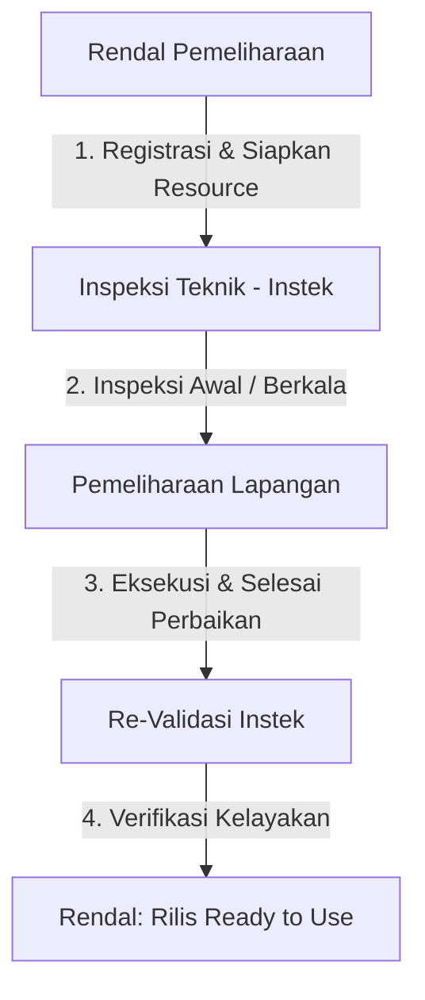

# Catatan Rapat Penyelarasan Sistem Manajemen Idle Equipment
**Hari/Tanggal:** Kamis, 6 Agustus 2026  
**Tempat:** Ruang Rapat Rendal Pemeliharaan  
**Agenda:** Penyesuaian Alur Bisnis, Peran Pengguna (Roles), Status Aset, dan Aturan Form Teknis  

---

## 1. Pemetaan Peran Pengguna (User Roles) & Tanggung Jawab
Struktur organisasi sistem diperluas untuk mencakup pemisahan wewenang yang lebih jelas antara perencana (*planner*), pengawas (*inspector*), dan eksekutor lapangan (*maintenance team*).

### A. Rendal Pemeliharaan (Planner & Coordinator)
* **Pendaftaran Aset:** Mendaftarkan unit *Idle Equipment* ke dalam sistem (mengisi data administrasi awal).
* **Penyediaan Sumber Daya:** Bertanggung jawab penuh menyiapkan material, suku cadang (*spareparts*), peralatan kerja, hingga mekanik/tenaga kerja sebelum menyerahkan perintah kerja ke Pemeliharaan Lapangan.
* **Wewenang Akhir Status:** Memiliki hak eksklusif untuk mengubah status akhir aset menjadi **Ready to Use** setelah dinyatakan lolos uji pasca-perbaikan oleh Inspeksi Teknik.
* **Pelayanan Unit Kerja:** Menjadi pintu gerbang utama bagi Unit Kerja Operasi yang membutuhkan alat siap pakai (Unit Kerja tidak perlu ke Pemeliharaan Lapangan, cukup meminta ke Rendal Pemeliharaan karena data tersentralisasi).

### B. Inspeksi Teknik - Instek (Validator & Auditor)
* **Validasi Kelayakan Awal:** Melakukan uji kelayakan pertama setelah alat didaftarkan oleh Rendal Pemeliharaan.
* **Inspeksi Periodik:** Melakukan inspeksi secara berkala dan terjadwal terhadap seluruh peralatan yang sedang menganggur (*Idle* atau *Ready to Use*) untuk memastikan kesiapan operasi.
* **Rekomendasi Tindakan:** Menetapkan rekomendasi teknis (Layak Digunakan, Perlu Refurbishment/Perbaikan, atau *Disposal Recommended*).
* **Re-Validasi Pasca-Perbaikan:** Melakukan pengetesan ulang (Uji Fungsi) setelah tim Pemeliharaan Lapangan menyelesaikan perbaikan aset, lalu menerbitkan keputusan kelayakan ulang (*Yes / No*).

### C. Pemeliharaan Lapangan (Eksekutor Lapangan)
* **Struktur Sub-Unit:** Terdiri dari 4 disiplin keahlian utama:
  1. **Mekanik**
  2. **Listrik**
  3. **Instrumen**
  4. **Pembengkelan**
* **Eksekusi Pekerjaan:** Melakukan tindakan perbaikan fisik di lapangan menggunakan peralatan khusus berdasarkan alokasi sumber daya yang disiapkan Rendal Pemeliharaan.
* **Eskalasi Kendala:** Jika dalam proses eksekusi ditemui kendala (misal kekurangan material tambahan), eksekutor akan mengirimkan notifikasi permintaan bantuan/material langsung ke Rendal Pemeliharaan.
* **Laporan Selesai:** Mengubah status pengerjaan menjadi "Selesai Perbaikan" di dalam sistem untuk menotifikasi Instek agar segera melakukan uji re-validasi kelayakan.

### D. Unit Kerja Operasi (End User)
* **Kebutuhan Alat:** Mengajukan permintaan pemakaian alat langsung ke Rendal Pemeliharaan berdasarkan basis data ketersediaan alat yang valid (tidak perlu mencari alat secara manual ke gudang pemeliharaan).

---

## 2. Alur Status & Siklus Hidup Aset (Asset Lifecycle)

Aset akan bergerak melalui status-status berikut secara berurutan:

1. **REGISTERED (Rendal Pemeliharaan)**
   * Aset didaftarkan ke sistem oleh Rendal Pemeliharaan.
2. **VALIDATED (Inspeksi Teknik / Instek)**
   * Instek melakukan pengecekan awal. Jika dinyatakan layak, status menjadi *Validated*. Jika perlu perbaikan, status diarahkan menuju alur perbaikan.
3. **REPAIR / MAINTENANCE (Koordinasi Rendal & Pemeliharaan Lapangan)**
   * Rendal Pemeliharaan menyiapkan kebutuhan perbaikan (suku cadang, alat, penunjukan mekanik).
   * Setelah sumber daya siap, perintah kerja dieksekusi oleh unit Pemeliharaan Lapangan terkait (Mekanik/Listrik/Instrumen/Pembengkelan).
   * Eksekutor menyelesaikan perbaikan fisik dan menekan tombol **"Selesai Perbaikan"**.
4. **RE-VALIDASI (Inspeksi Teknik / Instek)**
   * Aset yang selesai diperbaiki diuji ulang oleh Instek untuk memastikan kualitas perbaikan (*Yes/No*).
5. **READY TO USE (Rendal Pemeliharaan)**
   * Berdasarkan hasil *Re-Validasi* Instek yang sukses, Rendal Pemeliharaan mengonfirmasi dan mengubah status aset menjadi **Ready to Use** (siap dialokasikan).

---

## 3. Penyesuaian Formulir & Aturan Teknis Sistem

Untuk mempermudah penggunaan di lapangan dan menghindari kesalahan input data, dilakukan beberapa penyesuaian aturan pengisian formulir sebagai berikut:

### A. Parameter Informasi Aset (Pendaftaran Alat)
* **Merk Peralatan:** Diubah menjadi **Wajib Diisi** (*Required Field*).
* **Tahun Perolehan:** Diubah menjadi **Opsional** (*Optional*).
* **Nilai Perolehan:** Diubah menjadi **Opsional** (*Optional*).
* **Lokasi Penyimpanan:** Dibuat dinamis (*Customized Location*) di mana data lokasi dikelola secara sentral oleh Administrator melalui menu Master Data agar seragam dan terstandar.

### B. Form Inspeksi & Penomoran Pemeriksaan
* **Penghapusan Log Durasi:** Field **"Jam Mulai"**, **"Jam Selesai"**, dan **"Durasi"** dihapus dari formulir.
* **Log Tanggal:** Diganti dengan **Tanggal Mulai Pengecekan** dan **Tanggal Selesai Pengecekan**.
* **Kode Aset:** Tidak boleh diketik secara manual (*Read-Only*) untuk menghindari kesalahan ketik kode alat. Input harus berupa pilihan daftar aset (*dropdown select*).
* **Nomor Pemeriksaan (Format MCE & Counting Number):**
  * Format menggunakan standar penomoran perusahaan agar familiar bagi user.
  * Harus memiliki **Counting Number** minimal 4 digit (misal: `0001` s.d `9999`) untuk menampung data volume tinggi (di atas 999 barang).
  * Dilengkapi kode pembeda dan tahun untuk mengantisipasi jika kode aset yang sama diinspeksi kembali di kemudian hari.
  * **Contoh Format:** `[Counting Number]/MCE-IDLE/[Tahun Pengecekan]` $\rightarrow$ **`0001/MCE-IDLE/2026`**

### C. Logika Validasi Kondisi & Kelayakan Aset
* **Status: LAYAK DIGUNAKAN**
  * Pilihan kondisi aset dibatasi hanya pada 3 kategori: **Bagus**, **Rusak Ringan**, atau **Rusak Sedang**.
* **Status: TIDAK LAYAK DIGUNAKAN (Rekomendasi Disposal)**
  * Sistem akan **secara otomatis mengunci kondisi aset menjadi RUSAK BERAT** (pilihan kondisi lain akan dinonaktifkan/disembunyikan oleh sistem untuk mencegah inkonsistensi data).
